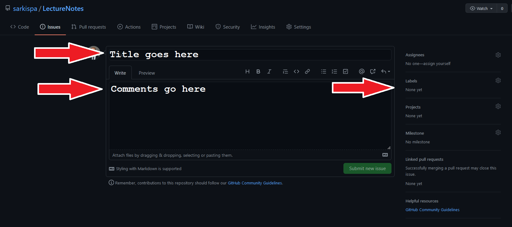

Thanks for using and showing appreciation of my lecture notes. My fav way of receiving appreciation is through community improvements, so if you have ideas of what to improve in the notes I shared, please participate in making them better.

The best way to contribute requires you to get used to GitHub, fork the Lecture Notes repository, clone it to your computer, commit changes on a new branch, and make pull requests. A good guide for learning how to do it is located [here](https://github.com/firstcontributions/first-contributions). If you don't want to invest the time, you can follow the easiest way outlined below.

**Easiest way:**
1. Create a GitHub account.
2. Go to the [Lecture Notes repository](https://github.com/sarkispa/LectureNotes/).
3. Navigate to the Issues tab and create an issue following the pattern described below:
    - **Title:** Course title + Quick description of the change requested.
        - example 1: "7751 - Wrong formula on p.57"
        - example 2: "7751 - Completing Shocks to preferences on p.20"
    - **Comment:** Add details on why you request the change.
    - **Label:** choose a label to categorize your issue. Four labels exist:
        - mistake: sth is not right in the text.
        - improvement: sth needs to be improved on or completed
        - discussion: for discussing topics related to the notes
        - question: for asking a question about the notes

